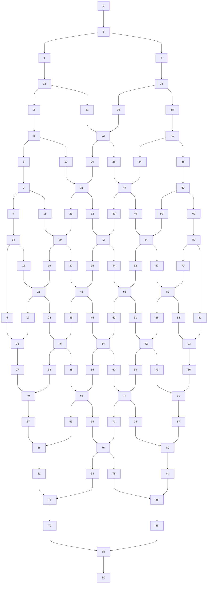

see [mermaid syntax for flowchart](https://mermaid.js.org/syntax/flowchart.html)

```mermaid
flowchart TD

    0 ---> 6
    1 ---> 12
    2 ---> 8
    3 ---> 9
    4 ---> 14
    5 ---> 25
    6 ---> 1
    6 ---> 7
    7 ---> 28
    8 ---> 3
    8 ---> 10
    9 ---> 4
    9 ---> 11
    10 ---> 31
    11 ---> 29
    12 ---> 2
    12 ---> 13
    13 ---> 22
    14 ---> 5
    14 ---> 15
    15 ---> 21
    16 ---> 22
    17 ---> 25
    18 ---> 41
    19 ---> 21
    20 ---> 31
    21 ---> 17
    21 ---> 24
    22 ---> 20
    22 ---> 26
    23 ---> 29
    24 ---> 46
    25 ---> 27
    26 ---> 47
    27 ---> 40
    28 ---> 16
    28 ---> 18
    29 ---> 19
    29 ---> 30
    30 ---> 43
    31 ---> 23
    31 ---> 32
    32 ---> 42
    33 ---> 40
    34 ---> 47
    35 ---> 43
    36 ---> 46
    37 ---> 56
    38 ---> 60
    39 ---> 42
    40 ---> 37
    41 ---> 34
    41 ---> 38
    42 ---> 35
    42 ---> 44
    43 ---> 36
    43 ---> 45
    44 ---> 58
    45 ---> 64
    46 ---> 33
    46 ---> 48
    47 ---> 39
    47 ---> 49
    48 ---> 63
    49 ---> 54
    50 ---> 54
    51 ---> 77
    52 ---> 58
    53 ---> 56
    54 ---> 52
    54 ---> 57
    55 ---> 63
    56 ---> 51
    57 ---> 82
    58 ---> 59
    58 ---> 61
    59 ---> 64
    60 ---> 50
    60 ---> 62
    61 ---> 72
    62 ---> 80
    63 ---> 53
    63 ---> 65
    64 ---> 55
    64 ---> 67
    65 ---> 76
    66 ---> 72
    67 ---> 74
    68 ---> 77
    69 ---> 74
    70 ---> 82
    71 ---> 76
    72 ---> 69
    72 ---> 73
    73 ---> 91
    74 ---> 71
    74 ---> 75
    75 ---> 89
    76 ---> 68
    76 ---> 78
    77 ---> 79
    78 ---> 88
    79 ---> 92
    80 ---> 70
    80 ---> 81
    81 ---> 93
    82 ---> 66
    82 ---> 83
    83 ---> 93
    84 ---> 88
    85 ---> 92
    86 ---> 91
    87 ---> 89
    88 ---> 85
    89 ---> 84
    91 ---> 87
    92 ---> 90
    93 ---> 86

```
